# PSoC&trade; 4: CAPSENSE&trade; CSD slider tuning

This code example demonstrates how to manually tune a self-capacitance (CSD)-based slider widget in the PSoC&trade; 4 devices using CAPSENSE&trade; tuner.

This document includes: 
- A high-level overview of the CAPSENSE&trade; Sigma Delta (CSD) slider widget tuning flow. 
- An example to manually tune a CSD slider widget.
- A procedure on how to use the CAPSENSE&trade; tuner to monitor the CAPSENSE&trade; raw data and fine-tune the CSD slider for optimum performance in parameters such as response time and linearity.

[View this README on GitHub.](https://github.com/Infineon/mtb-example-psoc4-capsense-csd-slider-tuning)

[Provide feedback on this code example.](https://cypress.co1.qualtrics.com/jfe/form/SV_1NTns53sK2yiljn?Q_EED=eyJVbmlxdWUgRG9jIElkIjoiQ0UyMzA0OTMiLCJTcGVjIE51bWJlciI6IjAwMi0zMDQ5MyIsIkRvYyBUaXRsZSI6IlBTb0MmdHJhZGU7IDQ6IENBUFNFTlNFJnRyYWRlOyBDU0Qgc2xpZGVyIHR1bmluZyIsInJpZCI6InNhaGciLCJEb2MgdmVyc2lvbiI6IjMuMS4wIiwiRG9jIExhbmd1YWdlIjoiRW5nbGlzaCIsIkRvYyBEaXZpc2lvbiI6Ik1DRCIsIkRvYyBCVSI6IklDVyIsIkRvYyBGYW1pbHkiOiJQU09DIn0=)

## Requirements

- [ModusToolbox&trade; software](https://www.infineon.com/modustoolbox) v3.1 or later (tested with v3.1)

   **Note:** This code example version requires ModusToolbox&trade; software version 3.1 or later and is not backward compatible with v2.4 or older versions.

- Board support package (BSP) minimum required version: 3.0.0
- Programming language: C
- Associated parts: [PSoC&trade; 4100S, PSoC&trade; 4100S Plus and PSoC&trade; 4500S](https://www.infineon.com/cms/en/product/microcontroller/32-bit-psoc-arm-cortex-microcontroller/psoc-4-32-bit-arm-cortex-m0-mcu/)

## Supported toolchains (make variable 'TOOLCHAIN')

- GNU Arm&reg; embedded compiler v11.3.1 (`GCC_ARM`) - Default value of `TOOLCHAIN`
- Arm&reg; compiler v6.16 (`ARM`)
- IAR C/C++ compiler v9.30.1 (`IAR`)


## Supported kits (make variable 'TARGET')

- [PSoC&trade; 4100S Plus prototyping kit](https://www.infineon.com/CY8CKIT-149) (`CY8CKIT-149`) - Default value of `TARGET`
- [PSoC&trade; 4000S CAPSENSE&trade; prototyping kit](https://www.infineon.com/CY8CKIT-145) (`CY8CKIT-145-40XX`)
- [PSoC&trade; 4500S pioneer kit](https://infineon.com/CY8CKIT-045S) (`CY8CKIT-045S`)


## Hardware setup

This example uses the board's default configuration. See the kit user guide to ensure that the board is configured correctly.

**Note:** The PSoC&trade; 4 kits ship with KitProg2 installed. The ModusToolbox&trade; software requires KitProg3. Before using this code example, make sure that the board is upgraded to KitProg3. The tool and instructions are available in the [Firmware Loader](https://github.com/Infineon/Firmware-loader) GitHub repository. If you do not upgrade, you will see an error like "unable to find CMSIS-DAP device" or "KitProg firmware is out of date".


## Software setup

This example does not require any additional software or tools.


## Using the code example

Create the project and open it using one of the following:

<details><summary><b>In Eclipse IDE for ModusToolbox&trade; software</b></summary>

1. Click the **New Application** link in the **Quick Panel** (or, use **File** > **New** > **ModusToolbox&trade; Application**). This launches the [Project Creator](https://www.infineon.com/ModusToolboxProjectCreator) tool.

2. Pick a kit supported by the code example from the list shown in the **Project Creator - Choose Board Support Package (BSP)** dialog.

   When you select a supported kit, the example is reconfigured automatically to work with the kit. To work with a different supported kit later, use the [Library Manager](https://www.infineon.com/ModusToolboxLibraryManager) to choose the BSP for the supported kit. You can use the Library Manager to select or update the BSP and firmware libraries used in this application. To access the Library Manager, click the link from the **Quick Panel**.

   You can also just start the application creation process again and select a different kit.

   If you want to use the application for a kit not listed here, you may need to update the source files. If the kit does not have the required resources, the application may not work.

3. In the **Project Creator - Select Application** dialog, choose the example by enabling the checkbox.

4. (Optional) Change the suggested **New Application Name**.

5. The **Application(s) Root Path** defaults to the Eclipse workspace which is usually the desired location for the application. If you want to store the application in a different location, you can change the *Application(s) Root Path* value. Applications that share libraries should be in the same root path.

6. Click **Create** to complete the application creation process.

For more details, see the [Eclipse IDE for ModusToolbox&trade; software user guide](https://www.infineon.com/MTBEclipseIDEUserGuide) (locally available at *{ModusToolbox&trade; software install directory}/docs_{version}/mt_ide_user_guide.pdf*).

</details>

<details><summary><b>In command-line interface (CLI)</b></summary>

ModusToolbox&trade; software provides the Project Creator as both a GUI tool and a command line tool, "project-creator-cli". The CLI tool can be used to create applications from a CLI terminal or from within batch files or shell scripts. This tool is available in the *{ModusToolbox&trade; software install directory}/tools_{version}/project-creator/* directory.

Use a CLI terminal to invoke the "project-creator-cli" tool. On Windows, use the command line "modus-shell" program provided in the ModusToolbox&trade; software installation instead of a standard Windows command-line application. This shell provides access to all ModusToolbox&trade; software tools. You can access it by typing `modus-shell` in the search box in the Windows menu. In Linux and macOS, you can use any terminal application.

The "project-creator-cli" tool has the following arguments:

Argument | Description | Required/optional
---------|-------------|-----------
`--board-id` | Defined in the `<id>` field of the [BSP](https://github.com/Infineon?q=bsp-manifest&type=&language=&sort=) manifest | Required
`--app-id`   | Defined in the `<id>` field of the [CE](https://github.com/Infineon?q=ce-manifest&type=&language=&sort=) manifest | Required
`--target-dir`| Specify the directory in which the application is to be created if you prefer not to use the default current working directory | Optional
`--user-app-name`| Specify the name of the application if you prefer to have a name other than the example's default name | Optional

<br />

The following example clones the "[CAPSENSE&trade; CSD slider tuning](https://github.com/Infineon/mtb-example-psoc4-capsense-csd-slider-tuning)" application with the desired name "CsdSliderTuning" configured for the *CY8CKIT-145-40XX* BSP into the specified working directory, *C:/mtb_projects*:

   ```
   project-creator-cli --board-id CY8CKIT-145-40XX --app-id mtb-example-psoc4-capsense-csd-slider-tuning --user-app-name CsdSliderTuning --target-dir "C:/mtb_projects"
   ```

**Note:** The project-creator-cli tool uses the `git clone` and `make getlibs` commands to fetch the repository and import the required libraries. For details, see the "Project creator tools" section of the [ModusToolbox&trade; software user guide](https://www.infineon.com/ModusToolboxUserGuide) (locally available at *{ModusToolbox&trade; software install directory}/docs_{version}/mtb_user_guide.pdf*).

To work with a different supported kit later, use the [Library Manager](https://www.infineon.com/ModusToolboxLibraryManager) to choose the BSP for the supported kit. You can invoke the Library Manager GUI tool from the terminal using `make library-manager` command or use the Library Manager CLI tool "library-manager-cli" to change the BSP.

The "library-manager-cli" tool has the following arguments:

Argument | Description | Required/optional
---------|-------------|-----------
`--add-bsp-name` | Name of the BSP that should be added to the application | Required
`--set-active-bsp` | Name of the BSP that should be as active BSP for the application | Required
`--add-bsp-version`| Specify the version of the BSP that should be added to the application if you do not wish to use the latest from manifest | Optional
`--add-bsp-location`| Specify the location of the BSP (local/shared) if you prefer to add the BSP in a shared path | Optional

<br />

Following example adds the CY8CKIT-149 BSP to the already created application and makes it the active BSP for the app:

   ```
   ~/ModusToolbox/tools_3.1/library-manager/library-manager-cli --project "C:/mtb_projects/CsdSliderTuning" --add-bsp-name CY8CKIT-149 --add-bsp-version "latest-v3.X" --add-bsp-location "local"

   ~/ModusToolbox/tools_3.1/library-manager/library-manager-cli --project "C:/mtb_projects/CsdSliderTuning" --set-active-bsp APP_CY8CKIT-149
   ```

</details>

<details><summary><b>In third-party IDEs</b></summary>

Use one of the following options:

- **Use the standalone [Project Creator](https://www.infineon.com/ModusToolboxProjectCreator) tool:**

   1. Launch Project Creator from the Windows Start menu or from *{ModusToolbox&trade; software install directory}/tools_{version}/project-creator/project-creator.exe*.

   2. In the initial **Choose Board Support Package** screen, select the BSP, and click **Next**.

   3. In the **Select Application** screen, select the appropriate IDE from the **Target IDE** drop-down menu.

   4. Click **Create** and follow the instructions printed in the bottom pane to import or open the exported project in the respective IDE.

<br />

- **Use command-line interface (CLI):**

   1. Follow the instructions from the **In command-line interface (CLI)** section to create the application.

   2. Export the application to a supported IDE using the `make <ide>` command.

   3. Follow the instructions displayed in the terminal to create or import the application as an IDE project.

For a list of supported IDEs and more details, see the "Exporting to IDEs" section of the [ModusToolbox&trade; software user guide](https://www.infineon.com/ModusToolboxUserGuide) (locally available at *{ModusToolbox&trade; software install directory}/docs_{version}/mtb_user_guide.pdf*).

</details>


## Operation

The following steps explain the tuning procedure. Because the project already has the necessary settings by default, you can skip this procedure and go to [Testing the basic operation](#testing-the-basic-operation) to verify the operation. If you want to understand the tuning process and follow the steps for this kit or your own board, see [Tuning procedure](#tuning-procedure).

**Note:** See the section "Selecting CAPSENSE&trade; hardware parameters" in the [PSoC&trade; 4 and PSoC&trade; 6 MCU CAPSENSE&trade; design guide](https://www.infineon.com/AN85951) to learn about the considerations for selecting parameter values.

### Tuning procedure

**Figure 1. CSD slider widget tuning flow**  


   
Do the following to tune the slider: 

<details><summary><b> Stage 1: Measure the parasitic capacitance (Cp) </b></summary>

Use the `Cy_CapSense_MeasureCapacitanceSensor()` function to measure the parasitic capacitance (Cp) of each slider element to determine the slider element with the maximum Cp. You can also use an LCR meter to measure the Cp of the slider segments. 
Do the following to determine the Cp values in debug mode:

1. Program the board in debug mode.

   In the IDE, use the **\<Application Name> Debug (KitProg3)** configuration in the **Quick Panel**.
   
   For more details, see the "Program and debug" section in the Eclipse IDE for ModusToolbox&trade; software user guide: *{ModusToolbox&trade; install directory}/ide_{version}/docs/mt_ide_user_guide.pdf*.

2. Place a breakpoint after the capacitance measurement.

3. In the **Expressions** window, add the Cp measurement variable array: `sense_cap`. 

   The status of the measurement can also be read through the return value of the function using the variable `measure_status` in the **Expressions** window.

4. Click the **Resume** button (green arrow) to reach the breakpoint. 

   Note that the function return value reads `CY_CAPSENSE_BIST_SUCCESS_E` and the measurement variables provide the capacitance of the sensor elements in *femtofarads*.

   **Figure 2. Sensor capacitance measurement values obtained in debug mode**

   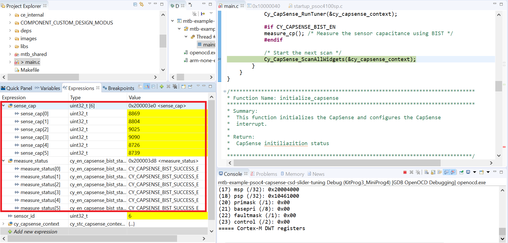

5. Click the **Terminate** button (red box) to exit debug mode.

**Table 1. Cp values obtained for CY8CKIT-149, CY8CKIT-145 and CY8CKIT-045S kits**

| Slider segment  | CY8CKIT-149 parasitic capacitance (Cp) (pF) | CY8CKIT-145 parasitic capacitance (Cp) (pF)| CY8CKIT-045S parasitic capacitance (Cp) (pF) |
|:----------------|:----------------------------------------|:----------------------------| :-------------|
| Sns0            | 9                                     |13| 10 |
| Sns1            | 8                                     |12| 10 |
| Sns2            | 9                                     |14| 10 |
| Sns3            | 9                                     |14| 10 |
| Sns4            | 8                                     |14| 11 |
| Sns5            | 8                                     |-| - |

</details>

<details><summary><b> Stage 2: Calculate the sense clock frequency </b></summary>

Equation 1 is used to find the maximum possible sense clock frequency. Calculate the sense clock frequency using equation 1:

**Equation 1:**


Where,
- C<sub>P</sub> is the sensor parasitic capacitance. 

- R<sub>SeriesTotal</sub> is the total series-resistance. This includes the 500-Ω resistance of the internal switches, the recommended external series resistance of 560 Ω or 2 kΩ (connected on the PCB trace connecting the sensor pad to the device pin), and the trace resistance if using highly resistive materials (for example Indium Tin Oxide (ITO) or conductive ink); that is, a total of 1.06 kΩ or 2.5 kΩ plus the trace resistance. 

**Table 2. Sense clock frequency for CY8CKIT-149, CY8CKIT-145 and CY8CKIT-045S kits**

| Kit | R<sub>SeriesTotal</sub> (kΩ) | Cp (pF) | Maximum sense clock frequency (kHz) |
| :--------- | :------------    | :------------ | :------- |
| CY8CKIT-149 | 2.5 | 9 | 4444 |
| CY8CKIT-145 | 1.06 | 14 | 6500 |
| CY8CKIT-045S | 1.06 | 11 | 8576 |

The calculated value, listed in Table 2, ensures the maximum possible sense clock frequency (for a good gain) while allowing the sensor capacitance to fully charge and discharge during each sense clock cycle.

</details>

<details><summary><b> Stage 3: Set the initial hardware parameters </b></summary>

1. Connect the board to your PC using the provided USB cable through the KitProg3 USB connector.

2. Launch the CAPSENSE&trade; configurator tool.
   
   The CAPSENSE&trade; configurator tool can be launched in Eclipse IDE for ModusToolbox&trade; from the 'CSD peripheral' setting in the device configurator or in stand-alone mode directly from the Project Explorer.

   See the [ModusToolbox&trade; CAPSENSE&trade; configurator tool guide](https://www.infineon.com/ModusToolboxCapSenseConfig) for step-by-step instructions on how to configure and launch CAPSENSE&trade; in ModusToolbox&trade; software. 

3. In the **Basic** tab, note that a single slider **LinearSlider0** is configured as a **CSD (Self-cap)** and the CSD tuning mode is configured as **Manual tuning**. 

   **Figure 3. CAPSENSE&trade; configurator - Basic tab**  

   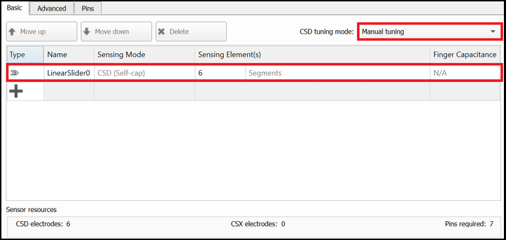

4. Do the following in the **General** sub-tab under the **Advanced** tab:

   - (Optional) Clear the **Enable self-test library** selection which was required for Capacitance measurement using built in self test (BIST) in **Stage 1**.
   
   - Retain the default settings for all filters. You can enable the filters later depending on the signal-to-noise ratio (SNR) requirements in **Stage 5**.

   **Figure 4. CAPSENSE&trade; configurator - General sub-tab in Advanced Tab**  

   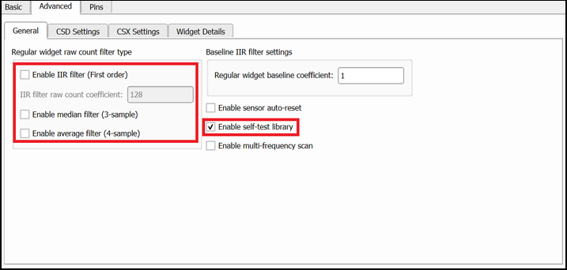

5. Go to the **CSD Settings** tab and make the following changes:
   
   - Set **Modulator clock divider** as '1' to obtain the maximum available modulator clock frequency as recommended in the [CAPSENSE&trade; design guide](https://www.infineon.com/AN85951).

       **Note:** You can change the modulator clock frequency to 48,000 kHz only after changing the IMO clock frequency to 48 MHz: Do the following to do so:

       1. Under the **System** tab in the **Device Configurator** tool, select **System Clocks** > **Input** > **IMO**. 
    
       2. Select **48** from the **Frequency (MHz)** drop-down list.

       **Figure 5. Changing IMO clock frequency in the Device Configurator**  

       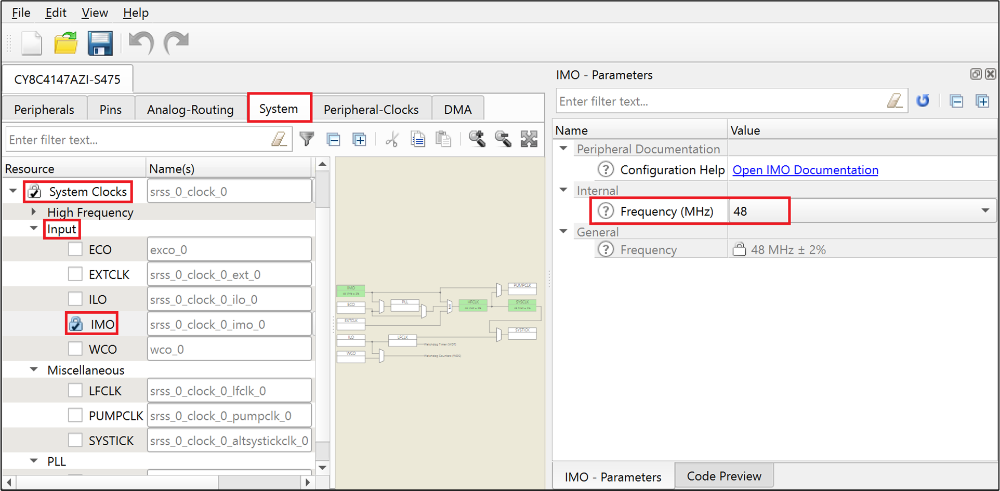 

   - Select **Enable IDAC auto-calibration** and **Enable compensation IDAC**. 
   
     This helps in achieving the required IDAC calibration levels for all segments in the widget while maintaining the same sensitivity across segments.

      **Figure 6. CAPSENSE&trade; configurator - CSD settings sub-tab in Advanced Tab**  

      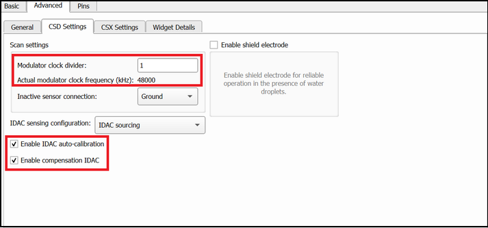

6. Go to the **Widget Details** tab. Select **LinearSlider0** from the left pane and then set the following:

   - **Sense clock divider:** **11**

      **Note:** The sense clock divider value is obtained by dividing HFCLK (48 MHz) by the value in **Maximum Sense Clock Frequency (kHz)** calculated in **Stage 2** (see **Table 2**) and choosing the nearest possible Sense Clock Divider option in the Configurator. Maximum sense clock frequency is the maximum value of sense clock frequency that can be used. Also ensure that it does not exceed the maximum supported sense clock frequency of 6 MHz. 

      In this case, 48000/4444 = 11.

   - Select **Auto** from the **Sense clock source** drop-down list.

   - **Scan resolution: 8 bits**

     8 bits is a good starting point to ensure a fast scan time and sufficient signal. This value will be adjusted as required in **Stage 5**.

   - **Noise threshold: 5** 
   
     This reduces the influence of baseline on the sensor signal, which helps to get the true difference count. Retain the default values for all other threshold parameters; these parameters are set in **Stage 6**.

      **Figure 7. CAPSENSE&trade; configurator - Widget details sub-tab in Advanced Tab**  
      
      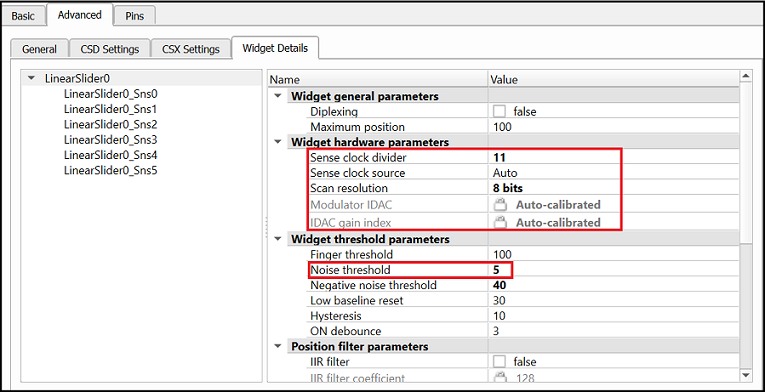

7. Click **Save** to apply the settings.

</details>

<details><summary><b> Stage 4: Obtain the cross-over points and noise </b></summary>

1. Program the board.


2. Launch the CAPSENSE&trade; tuner to monitor the CAPSENSE&trade; data and for CAPSENSE&trade; parameter tuning and SNR measurement.
 
   See the [CAPSENSE&trade; Tuner guide](https://www.infineon.com/ModusToolboxCapSenseTuner) for step-by-step instructions on how to launch and configure the CAPSENSE&trade; Tuner in ModusToolbox&trade; software.

3. Capture and note the peak-to-peak noise of each segment of the sliders. 

   **Table 3. Peak-to-peak noise obtained for each segment in CY8CKIT-149, CY8CKIT-145 and CY8CKIT-045S kits**
   
   |Slider segment |Peak-to-peak noise (CY8CKIT-149)|Peak-to-peak noise (CY8CKIT-145)| Peak-to-peak noise (CY8CKIT-045S) |
   |:--------------|:--------------------------|:-------| :----- |
   |Sns0   |8|6| 11 |
   |Sns1   |7|7| 4 |
   |Sns2   |8|6| 4 |
   |Sns3   |6|6| 5 |
   |Sns4   |8|9| 5 |
   |Sns5   |8|-| -|

4. From the **Widget Explorer** section, select a sensor (*LinearSlider0_Sns0*, for example). 

5. Go to the **SNR Measurement** tab and click **Acquire Noise**. 
   
   **Figure 8. SNR Measurement tab in Tuner window**  

   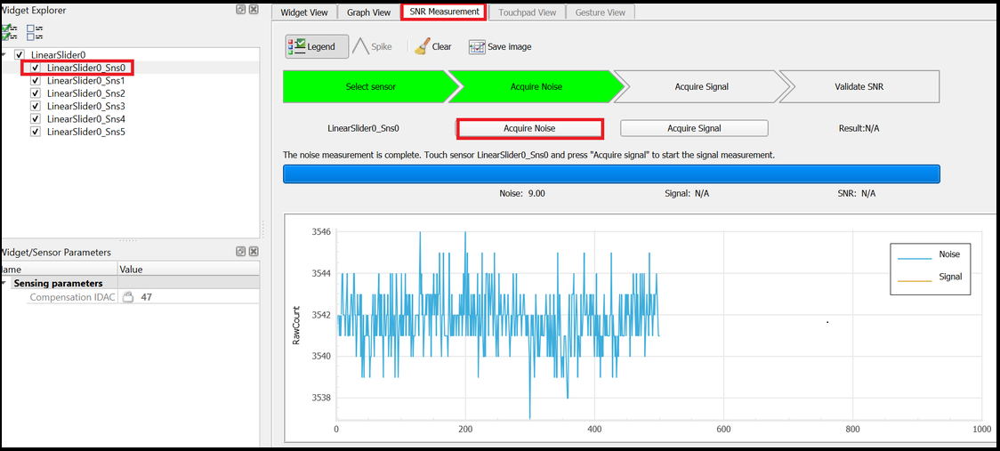

6. Use the grounded metal finger (typically 8 mm or 9 mm) and swipe it slowly at a constant speed from the start to end of the slider. 

      1. Go to the **Graph View** tab to view a graph similar to **Figure 9**.
      
      2. Get the upper crossover point (UCP) and lower crossover point (LCP) as shown in **Figure 10**.

      **Figure 9. Difference count (delta) vs. finger position**  

      

    Sensor signal values at points a, b, c, and d are expected to be at approximately the same level. If the values are slightly different, consider the lowest value as the UCP.

    Sensor signal values at points q, r, and s are expected to be at approximately the same level. If the values are slightly different, consider the lowest value as the LCP.

      **Figure 10. Sensor signal (difference counts) displayed in the graph view tab**  

      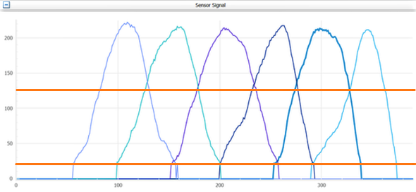

</details>

<details><summary><b> Stage 5. Use the CAPSENSE&trade; Tuner to fine-tune sensitivity for 5:1 SNR </b></summary>

The CAPSENSE&trade; system may be required to work reliably in adverse conditions such as a noisy environment. The slider segments need to be tuned with SNR > 5:1 to avoid triggering false touches and to make sure that all intended touches are registered in these adverse conditions.


1. Ensure that all UCPs meet at least 5:1 SNR (using equation 2) and all LCPs are greater than twice the peak-to-peak noise for all slider segments. 

   In the **Sensor Tuner** window, increase the **Scan resolution** (located in the **Widget/Sensor Parameters** section, under **Widget Hardware Parameters**) by one until you achieve this requirement.

   **Equation 2:** 
   
   

2. After changing the scan resolution, click **Apply to Device** to send the setting to the device. The change is reflected in the graphs.

   **Note:** The *Apply to Device* option is enabled only when the *Scan resolution* is changed.

3. If the SNR condition is not achieved even with the highest resolution, enable the filters in the **General** settings (go to the **Advanced** tab of the CAPSENSE&trade; Configurator: generally not required for this kit).

</details>

<details><summary><b> Stage 6. Use the CAPSENSE&trade; tuner to tune threshold parameters </b></summary>

After confirming that your design meets the timing parameters, and the SNR is greater than 5:1, set your threshold parameters.

1. Set the recommended threshold values for the slider widget using the LCP and UCP obtained in **Stage 5**:
   - Finger threshold – 80% of UCP
   - Noise threshold – LCP
   - Negative noise threshold – LCP
   - Hysteresis – 10% of UCP
   - ON debounce – 3
   - Low baseline reset - 30

**Table 4. Threshold parameters obtained for CY8CKIT-149, CY8CKIT-145 and CY8CKIT-045S kits** 

|Parameter|	CY8CKIT-149| CY8CKIT-145| CY8CKIT-045S |
|:--------|:-------------|:------| :---- |
|Scan resolution	|	12	| 12| 11 |
|Finger threshold 	|	100| 200 |	120|
|Noise threshold |20| 40| 25 |
|Hysteresis	| 10| 25| 15 |
|ON debounce	|3| 3| 3|
|Low baseline reset	| 30| 30| 30|
|Negative noise threshold	| 20| 40| 25|

### Applying settings to firmware

Click **Apply to Device** and **Apply to Project** in the CAPSENSE&trade; Tuner window to apply the settings to the device and project, respectively. Close the tuner.

**Figure 11. Apply to project**

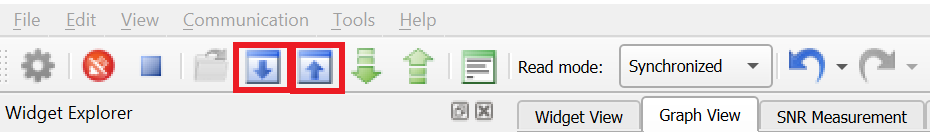

The change is updated in the *design.cycapsense* file and reflected in the **CAPSENSE&trade; Configurator** as well.

</details> 

## Testing the basic operation

1. Power the device by plugging a USB 2.0 Type A to Micro-B cable on J8 (USB Micro-B connector). 
      
   **Figure 12. Connecting the CY8CKIT-149 kit to a computer**

   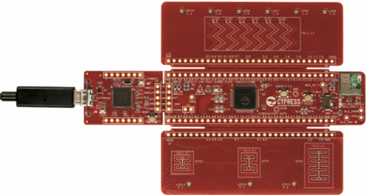

2. Program the board.

   - **Using Eclipse IDE for ModusToolbox&trade; software:**

      1. Select the application project in the Project Explorer.

      2. In the **Quick Panel**, scroll down, and click **\<Application Name> Program (KitProg3)**.

   - **Using CLI:**

     From the terminal, execute the `make program` command to build and program the application using the default toolchain to the default target. The default toolchain is specified in the application's Makefile but you can override this value manually:
      ```
      make program TOOLCHAIN=<toolchain>
      ```

      Example:
      ```
      make program TOOLCHAIN=GCC_ARM
      ```

      After programming, the application starts automatically. 

3. Slide your finger over the CAPSENSE&trade; linear slider.

4. Launch the CAPSENSE&trade; tuner to monitor the CAPSENSE&trade; data.
  
5. Select **Tools** > **Tuner Communication Setup**.

6. Select the appropriate I2C communication device, set the following parameters, and click **OK**: 

   - **I2C address: 8**
   - **Sub-address: 2-bytes**
   - **Speed (kHz): 1000**

     These are the same values set in the EZI2C resource.

      **Figure 13. Tuner communication setup parameters**

      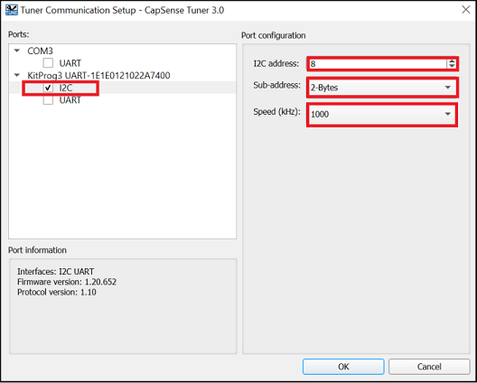

7. Click **Connect** to establish a connection.

8. Click **Start** to start data streaming from the device. 
   
   The Tuner GUI displays the data from the sensor in the **Widget View** and **Graph View** tabs. 
   
9. Set the **Read Mode** to Synchronized mode. The **Graph View** tab shows the raw count, difference count, position, and baselines for each segment. 

   **Figure 14. Graph view of the sense tuner**

   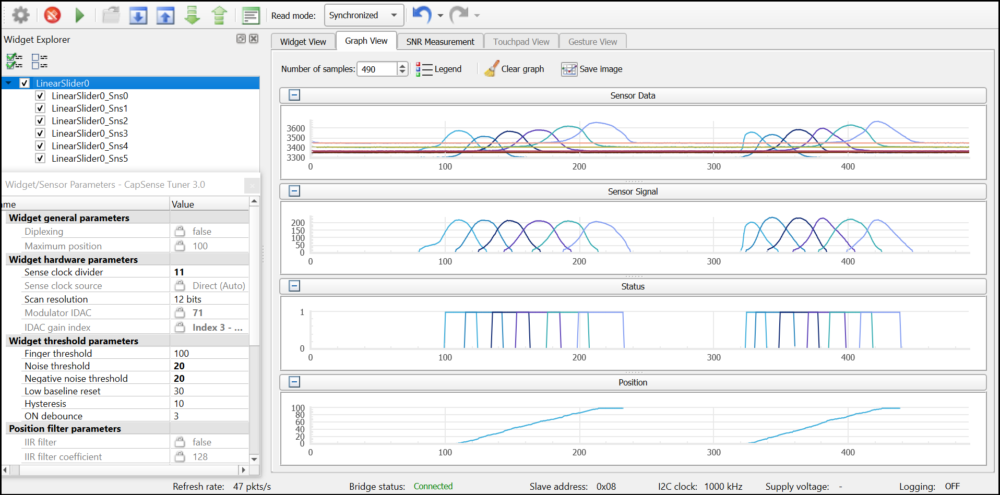

10. Observe the **Widget/Sensor Parameters** section in the CAPSENSE&trade; Tuner window. The Compensation IDAC values for each slider segment calculated by the CAPSENSE&trade; resource is displayed. 
      
     **Figure 15. IDAC values for the CSD slider widget**

     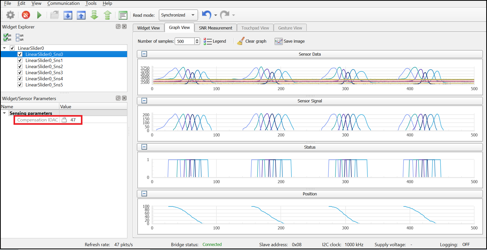

   The position graph obtained must be linear with no flat spots, ensuring that the slider has been tuned to have a linear response.

   **Figure 16. Response of centroid vs. finger location when signals of all slider elements are equal**

   


## Design and implementation

The project uses the [CAPSENSE&trade; middleware](https://github.com/Infineon/capsense) (see ModusToolbox&trade; software user guide for more details on selecting the middleware). See [AN85951 – PSoC&trade; 4 and PSoC&trade; 6 MCU CAPSENSE&trade; design guide](https://www.infineon.com/AN85951) for more details on CAPSENSE&trade; features and usage.

The design has a CSD based, 6-element CAPSENSE&trade; slider, and EZI2C peripheral. The EZI2C slave peripheral is used to monitor the sensor data and slider touch position information on a PC using the CAPSENSE&trade; tuner available in the Eclipse IDE for ModusToolbox&trade; via I2C communication.  

The code scans a slider widget using the CSD sensing method and sends the CAPSENSE&trade; raw data over an I2C interface to the CAPSENSE&trade; tuner GUI tool on a PC using the on-board KitProg USB-I2C bridge.

### Resources and settings

See the **Operation** section for step-by-step instructions to configure the CAPSENSE&trade; Configurator.

**Figure 17. Device configurator - EZI2C peripheral parameters**

 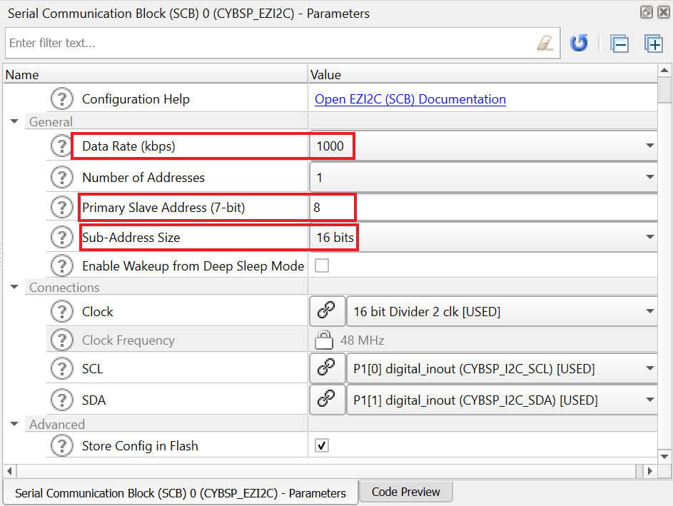

The following ModusToolbox&trade; resources are used in this example:

**Table 5. Application resources**

| Resource  |  Alias/object     |    Purpose     |
| :------- | :------------    | :------------ |
| SCB (I2C) (PDL) | CYBSP_EZI2C          | EZI2C slave driver to communicate with CAPSENSE&trade; tuner |
| CAPSENSE&trade; | CYBSP_CSD | CAPSENSE&trade; driver to interact with the CSD hardware and interface CAPSENSE&trade; sensors |

### Firmware flow

**Figure 18. Firmware flowchart**

 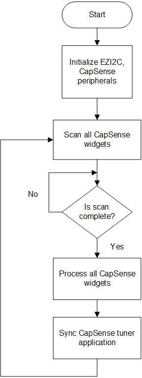

## Related resources

Resources  | Links
-----------|----------------------------------
Application notes  | [AN79953](https://www.infineon.com/AN79953) – Getting started with PSoC&trade; 4 <br /> [AN85951](https://www.infineon.com/AN85951) – PSoC&trade; 4 and PSoC&trade; 6 MCU CAPSENSE&trade; design guide
Code examples  | [Using ModusToolbox&trade; software](https://github.com/Infineon/Code-Examples-for-ModusToolbox-Software) on GitHub <br /> [Using PSoC&trade; Creator](https://www.infineon.com/cms/en/design-support/software/code-examples/psoc-3-4-5-code-examples-for-psoc-creator/)
Device documentation | [PSoC&trade; 4 datasheets](https://www.infineon.com/cms/en/search.html?intc=searchkwr-return#!view=downloads&term=psoc%204&doc_group=Data%20Sheet) <br /> [PSoC&trade; 4 technical reference manuals](https://www.infineon.com/cms/en/search.html#!view=downloads&term=psoc4&doc_group=Additional%20Technical%20Information)
Development kits | Select your kits from the [evaluation board finder](https://www.infineon.com/cms/en/design-support/finder-selection-tools/product-finder/evaluation-board)
Libraries on GitHub | [mtb-pdl-cat2](https://github.com/Infineon/mtb-pdl-cat2) – PSoC&trade; 4 peripheral driver library (PDL)<br /> [mtb-hal-cat2](https://github.com/Infineon/mtb-hal-cat2) – Hardware abstraction layer (HAL) library
Middleware on GitHub | [capsense](https://github.com/Infineon/capsense) – CAPSENSE&trade; library and documents <br />
Tools  | [ModusToolbox&trade; software](https://www.infineon.com/modustoolbox) – ModusToolbox&trade; software is a collection of easy-to-use software and tools enabling rapid development with Infineon MCUs, covering applications from embedded sense and control to wireless and cloud-connected systems using AIROC&trade; Wi-Fi and Bluetooth&reg; connectivity devices. <br /> [PSoC&trade; Creator](https://www.infineon.com/cms/en/design-support/tools/sdk/psoc-software/psoc-creator/) – IDE for PSoC&trade; and FM0+ MCU development

<br />

## Other resources

Infineon provides a wealth of data at www.infineon.com to help you select the right device, and quickly and effectively integrate it into your design.

## Document history

Document title: *CE230493* - *PSoC&trade; 4: CAPSENSE&trade; CSD slider tuning*

 Version | Description of change
 ------- | ---------------------
 1.0.0   | New code example
 2.0.0   | Added support for CY8CKIT-045S kit and updated to use CapSense MW 3.X
 3.0.0   | Major update to support ModusToolbox&trade; v3.0. This version is not backward compatible with previous versions of ModusToolbox&trade;
 3.1.0   | Update to support ModusToolbox&trade; v3.1 and CAPSENSE&trade; middleware v4.X
<br />

---------------------------------------------------------

© Cypress Semiconductor Corporation, 2020-2022. This document is the property of Cypress Semiconductor Corporation, an Infineon Technologies company, and its affiliates ("Cypress").  This document, including any software or firmware included or referenced in this document ("Software"), is owned by Cypress under the intellectual property laws and treaties of the United States and other countries worldwide.  Cypress reserves all rights under such laws and treaties and does not, except as specifically stated in this paragraph, grant any license under its patents, copyrights, trademarks, or other intellectual property rights.  If the Software is not accompanied by a license agreement and you do not otherwise have a written agreement with Cypress governing the use of the Software, then Cypress hereby grants you a personal, non-exclusive, nontransferable license (without the right to sublicense) (1) under its copyright rights in the Software (a) for Software provided in source code form, to modify and reproduce the Software solely for use with Cypress hardware products, only internally within your organization, and (b) to distribute the Software in binary code form externally to end users (either directly or indirectly through resellers and distributors), solely for use on Cypress hardware product units, and (2) under those claims of Cypress’s patents that are infringed by the Software (as provided by Cypress, unmodified) to make, use, distribute, and import the Software solely for use with Cypress hardware products.  Any other use, reproduction, modification, translation, or compilation of the Software is prohibited.
<br />
TO THE EXTENT PERMITTED BY APPLICABLE LAW, CYPRESS MAKES NO WARRANTY OF ANY KIND, EXPRESS OR IMPLIED, WITH REGARD TO THIS DOCUMENT OR ANY SOFTWARE OR ACCOMPANYING HARDWARE, INCLUDING, BUT NOT LIMITED TO, THE IMPLIED WARRANTIES OF MERCHANTABILITY AND FITNESS FOR A PARTICULAR PURPOSE.  No computing device can be absolutely secure.  Therefore, despite security measures implemented in Cypress hardware or software products, Cypress shall have no liability arising out of any security breach, such as unauthorized access to or use of a Cypress product. CYPRESS DOES NOT REPRESENT, WARRANT, OR GUARANTEE THAT CYPRESS PRODUCTS, OR SYSTEMS CREATED USING CYPRESS PRODUCTS, WILL BE FREE FROM CORRUPTION, ATTACK, VIRUSES, INTERFERENCE, HACKING, DATA LOSS OR THEFT, OR OTHER SECURITY INTRUSION (collectively, "Security Breach").  Cypress disclaims any liability relating to any Security Breach, and you shall and hereby do release Cypress from any claim, damage, or other liability arising from any Security Breach.  In addition, the products described in these materials may contain design defects or errors known as errata which may cause the product to deviate from published specifications. To the extent permitted by applicable law, Cypress reserves the right to make changes to this document without further notice. Cypress does not assume any liability arising out of the application or use of any product or circuit described in this document. Any information provided in this document, including any sample design information or programming code, is provided only for reference purposes.  It is the responsibility of the user of this document to properly design, program, and test the functionality and safety of any application made of this information and any resulting product.  "High-Risk Device" means any device or system whose failure could cause personal injury, death, or property damage.  Examples of High-Risk Devices are weapons, nuclear installations, surgical implants, and other medical devices.  "Critical Component" means any component of a High-Risk Device whose failure to perform can be reasonably expected to cause, directly or indirectly, the failure of the High-Risk Device, or to affect its safety or effectiveness.  Cypress is not liable, in whole or in part, and you shall and hereby do release Cypress from any claim, damage, or other liability arising from any use of a Cypress product as a Critical Component in a High-Risk Device. You shall indemnify and hold Cypress, including its affiliates, and its directors, officers, employees, agents, distributors, and assigns harmless from and against all claims, costs, damages, and expenses, arising out of any claim, including claims for product liability, personal injury or death, or property damage arising from any use of a Cypress product as a Critical Component in a High-Risk Device. Cypress products are not intended or authorized for use as a Critical Component in any High-Risk Device except to the limited extent that (i) Cypress’s published data sheet for the product explicitly states Cypress has qualified the product for use in a specific High-Risk Device, or (ii) Cypress has given you advance written authorization to use the product as a Critical Component in the specific High-Risk Device and you have signed a separate indemnification agreement.
<br />
Cypress, the Cypress logo, and combinations thereof, WICED, ModusToolbox, PSoC, CapSense, EZ-USB, F-RAM, and Traveo are trademarks or registered trademarks of Cypress or a subsidiary of Cypress in the United States or in other countries. For a more complete list of Cypress trademarks, visit www.infineon.com. Other names and brands may be claimed as property of their respective owners.
