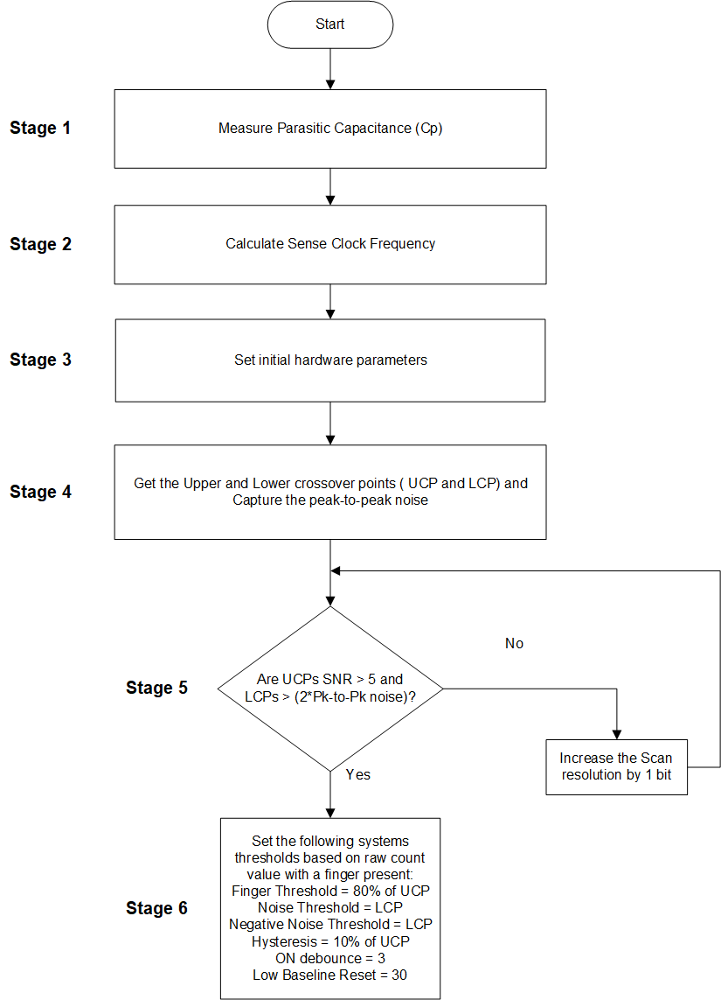

# PSoC 4: CapSense CSD Slider Tuning 

This code example demonstrates how to manually tune a self capacitance (CSD)-based slider widget in PSoC® 4 devices using CapSense Tuner.

This document includes: 
- A high-level overview of the CSD slider widget tuning flow. 
- An example to manually tune a CSD slider widget.
- A procedure on how to use the CapSense Tuner to monitor the CapSense raw data and fine-tune the CSD slider for optimum performance in parameters such as response time and linearity.

## Requirements

- [ModusToolbox® software](https://www.cypress.com/products/modustoolbox-software-environment) v2.2

  **Note:** This code example version requires ModusToolbox software version 2.2 or later and is not backward compatible with v2.1 or older versions. 

- Board Support Package (BSP) minimum required version: 1.0.0  
- Programming Language: C
- Associated Parts: [PSoC 4100S Plus](https://www.cypress.com/documentation/datasheets/psoc-4-psoc-4100s-plus-datasheet-programmable-system-chip-psoc), and [PSoC 4000S](https://www.cypress.com/documentation/datasheets/psoc-4-psoc-4000s-family-datasheet-programmable-system-chip-psoc)

## Supported Toolchains (make variable 'TOOLCHAIN')

- GNU Arm® Embedded Compiler v9.3.1 (GCC_ARM) - Default value of `TOOLCHAIN`
- Arm compiler v6.11 (ARM)
- IAR C/C++ compiler v8.42.2 (IAR)

## Supported Kits (make variable 'TARGET')

- [CY8CKIT-149 PSoC 4100S Plus Prototyping Kit](https://www.cypress.com/documentation/development-kitsboards/cy8ckit-149-psoc-4100s-plus-prototyping-kit) - Default target
- [CY8CKIT-145-40XX PSoC® 4000S CapSense Prototyping Kit](https://www.cypress.com/documentation/development-kitsboards/cy8ckit-145-40xx-psoc-4000s-capsense-prototyping-kit)

## Hardware Setup

This example uses the board's default configuration. See the kit user guide to ensure that the board is configured correctly.

**Note:** The CY8CKIT-149 PSoC 4100S Plus Prototyping Kit and the CY8CKIT-145-40XX PSoC® 4000S CapSense Prototyping Kits ship with KitProg2 installed. ModusToolbox software requires KitProg3. Before using this code example, make sure that the board is upgraded to KitProg3. The tool and instructions are available in the [Firmware Loader](https://github.com/cypresssemiconductorco/Firmware-loader) GitHub repository. If you do not upgrade, you will see an error like "unable to find CMSIS-DAP device" or "KitProg firmware is out of date".

## Software Setup

This example requires no additional software or tools.

## Using the Code Example

### In Eclipse IDE for ModusToolbox:

1. Click the **New Application** link in the **Quick Panel** (or, use **File** > **New** > **ModusToolbox Application**). This launches the [Project Creator](http://www.cypress.com/ModusToolboxProjectCreator) tool.

2. Pick a kit supported by the code example from the list shown in the **Project Creator - Choose Board Support Package (BSP)** dialog.

   When you select a supported kit, the example is reconfigured automatically to work with the kit. To work with a different supported kit later, use the [Library Manager](https://www.cypress.com/ModusToolboxLibraryManager) to choose the BSP for the supported kit. You can use the Library Manager to select or update the BSP and firmware libraries used in this application. To access the Library Manager, click the link from the Quick Panel. 

   You can also just start the application creation process again and select a different kit.

   If you want to use the application for a kit not listed here, you may need to update the source files. If the kit does not have the required resources, the application may not work.

3. In the **Project Creator - Select Application** dialog, choose the example by enabling the checkbox.

4. Optionally, change the suggested **New Application Name**.

5. Enter the local path in the **Application(s) Root Path** field to indicate where the application needs to be created. 

   Applications that can share libraries can be placed in the same root path.

6. Click **Create** to complete the application creation process.

For more details, see the [Eclipse IDE for ModusToolbox User Guide](https://www.cypress.com/MTBEclipseIDEUserGuide) (locally available at *{ModusToolbox install directory}/ide_{version}/docs/mt_ide_user_guide.pdf*).

### In Command-line Interface (CLI):

ModusToolbox provides the Project Creator as both a GUI tool and a command line tool to easily create one or more ModusToolbox applications. See the "Project Creator Tools" section of the [ModusToolbox User Guide](https://www.cypress.com/ModusToolboxUserGuide) for more details.

Alternatively, you can manually create the application using the following steps.

1. Download and unzip this repository onto your local machine, or clone the repository.

2. Open a CLI terminal and navigate to the application folder.

   On Linux and macOS, you can use any terminal application. On Windows, open the **modus-shell** app from the Start menu.

   **Note:** The cloned application contains a default BSP file (*TARGET_xxx.mtb*) in the *deps* folder. Use the [Library Manager](https://www.cypress.com/ModusToolboxLibraryManager) (`make modlibs` command) to select and download a different BSP file, if required. If the selected kit does not have the required resources or is not [supported](#supported-kits-make-variable-target), the application may not work. 

3. Import the required libraries by executing the `make getlibs` command.

Various CLI tools include a `-h` option that prints help information to the terminal screen about that tool. For more details, see the [ModusToolbox User Guide](https://www.cypress.com/ModusToolboxUserGuide) (locally available at *{ModusToolbox install directory}/docs_{version}/mtb_user_guide.pdf*).

### In Third-party IDEs:

1. Follow the instructions from the [CLI](#in-command-line-interface-cli) section to create the application, and import the libraries using the `make getlibs` command.

2. Export the application to a supported IDE using the `make <ide>` command. 

    For a list of supported IDEs and more details, see the "Exporting to IDEs" section of the [ModusToolbox User Guide](https://www.cypress.com/ModusToolboxUserGuide) (locally available at *{ModusToolbox install directory}/docs_{version}/mtb_user_guide.pdf*.

3. Follow the instructions displayed in the terminal to create or import the application as an IDE project.

## Operation

The following steps explain the tuning procedure. Because the project already has the necessary settings by default, you can skip this procedure and go to [Testing the Basic Operation](#testing-the-basic-operation) to verify the operation. If you want to understand the tuning process and follow the steps for this kit or your own board, see **Tuning Procedure**.

**Note:** See the Section "Selecting CapSense Hardware Parameters" in the [PSoC 4 and PSoC 6 MCU CapSense Design Guide](https://www.cypress.com/AN85951) to learn about the considerations for selecting parameter values.

### Tuning Procedure

**Figure 1. CSD Slider Widget Tuning Flow**  


   
Do the following to tune the slider: 

- [Stage 1: Measure the Parasitic Capacitance (Cp)](#stage-1-measure-the-parasitic-capacitance-cp)

- [Stage 2: Calculate the Sense Clock Frequency](#stage-2-calculate-the-sense-clock-frequency)

- [Stage 3: Set the Initial Hardware Parameters](#stage-3-set-the-initial-hardware-parameters)

- [Stage 4: Obtain Cross-Over Points and Noise](#stage-4-obtain-cross-over-points-and-noise)

- [Stage 5: Use the CapSense Tuner to Fine-Tune Sensitivity for 5:1 SNR](#stage-5-use-the-capsense-tuner-to-fine-tune-sensitivity-for-51-snr)

- [Stage 6: Use CapSense Tuner to Tune Threshold Parameters](#stage-6-use-capsense-tuner-to-tune-threshold-parameters)


#### Stage 1: Measure the Parasitic Capacitance (Cp)
-----------------------

Use the `Cy_CapSense_MeasureCapacitanceSensor()` function to measure the parasitic capacitance (Cp) of each slider element to determine the slider element with the maximum Cp. You can also use an LCR meter to measure the Cp of the slider segments. 
Do the following to determine the Cp values in debug mode:

1. Program the board in Debug mode.

   In the IDE, use the **\<Application Name> Debug (KitProg3)** configuration in the **Quick Panel**.
   
   For more details, see the "Program and Debug" section in the Eclipse IDE for ModusToolbox User Guide: *{ModusToolbox install directory}/ide_{version}/docs/mt_ide_user_guide.pdf*.

2. Place a breakpoint after the capacitance measurement.

3. In the **Expressions** window, add the Cp measurement variable array: `sense_cap[]`. 

   The status of the measurement can also be read through the return value of the function in the **Expressions** window.

4. Click the **Resume** button (green arrow) to reach the breakpoint. 

   Note that the function return value reads `CY_CAPSENSE_BIST_SUCCESS_E` and the measurement variables provide the capacitance of the sensor elements in *femtofarads*.

   **Figure 2. Sensor Capacitance Measurement Values Obtained in Debug Mode**

   

5. Click the **Terminate** button (red box) to exit debug mode.

**Table 1. Cp Values Obtained for CY8CKIT-149 and CY8CKIT-145 Kits**

| Slider segment  | CY8CKIT-149 Parasitic Capacitance (Cp) in pF | CY8CKIT-145 Parasitic Capacitance (Cp) in pF|
|:----------------|:----------------------------------------|:----------------------------|
| Sns0            | 9                                     |13|
| Sns1            | 8                                     |12|
| Sns2            | 9                                     |14|
| Sns3            | 9                                     |14|
| Sns4            | 8                                     |14|
| Sns5            | 8                                     |-|

#### Stage 2: Calculate the Sense Clock Frequency
--------------------

Calculate the sense clock frequency using Equation 1:

**Equation 1:**


Where,
- C<sub>P</sub> is the sensor parasitic capacitance. 

- R<sub>SeriesTotal</sub> is the total series-resistance. This includes the 500-Ω resistance of the internal switches, the recommended external series resistance of 560 Ω or 2 kΩ (connected on the PCB trace connecting the sensor pad to the device pin), and the trace resistance if using highly resistive materials (for example ITO or conductive ink); that is, a total of 1.06 kΩ or 2.5 kΩ plus the trace resistance. 

**Table 2. Sense Clock Frequency for CY8CKIT-149 and CY8CKIT-145 Kits**

| Kit | R<sub>SeriesTotal</sub> (kΩ) | Cp (pF) | Maximum Sense Clock Frequency (kHz) |
| :--------- | :------------    | :------------ | :------- |
| CY8CKIT-149 | 2.5 | 9 | 4444 |
| CY8CKIT-145 | 1.06 | 14 | 6500 |

The calculated value, listed in Table 2, ensures the maximum possible sense clock frequency (for a good gain) while allowing the sensor capacitance to fully charge and discharge during each sense clock cycle.

#### Stage 3: Set the Initial Hardware Parameters
-----------------

1. Connect the board to your PC using the provided USB cable through the KitProg3 USB connector.

2. Launch the CapSense Configurator tool.
   
   The CapSense Configurator Tool can be launched in Eclipse IDE for ModusToolbox from the 'CSD peripheral' setting in the Device Configurator or in stand-alone mode directly from the Project Explorer.

   See the [ModusToolbox CapSense Configurator Tool Guide](https://www.cypress.com/ModusToolboxCapSenseConfig) for step-by-step instructions on how to configure and launch CapSense in ModusToolbox. 

3. In the **Basic** tab, note that a single slider **LinearSlider0** is configured as a **CSD (Self-cap)** and the CSD tuning mode is configured as **Manual tuning**. 

   **Figure 3. CapSense Configurator - Basic Tab**  

   

4. Do the following in the **General** sub-tab under the **Advanced** tab:

   - (Optional) Clear the **Enable self-test library** selection which was required for [Capacitance Measurement Using BIST](#stage-1-measure-the-parasitic-capacitance-cp).
   
   - Retain the default settings for all filters. You can enable the filters later depending on the signal-to-noise ratio (SNR) requirements in [Stage 5](#stage-5-use-the-capsense-tuner-to-fine-tune-sensitivity-for-51-snr).

   **Figure 4. CapSense Configurator - General Sub-tab in Advanced Tab**  

   

5. Go to the **CSD Settings** tab and make the following changes:
   
   - Set **Modulator clock divider** as '1' to obtain the maximum available modulator clock frequency as recommended in the [CapSense Design guide](https://www.cypress.com/AN85951).

       **Note:** You can change the modulator clock frequency to 48,000 kHz only after changing the IMO clock frequency to 48 MHz. Do the following to do so:

       1. Under the **System** Tab in the **Device Configurator** tool, select **System Clocks** > **Input** > **IMO**. 
    
       2. Select **48** from the **Frequency(MHz)** drop-down list.

   - Select **Enable IDAC auto-calibration** and **Enable compensation IDAC**. 
   
     This helps in achieving the required IDAC calibration levels for all segments in the widget while maintaining the same sensitivity across segments.

      **Figure 5. CapSense Configurator - CSD Settings Sub-tab in Advanced Tab**  

      

6. Go to the **Widget Details** tab. Select **LinearSlider0** from the left pane and then set the following:

   - **Sense clock divider:** **11**

      **Note:** The sense clock divider value is obtained by dividing HFCLK (48 MHz) by the value in **Maximum Sense Clock Frequency (kHz)** calculated in [Stage 2](#stage-2-calculate-the-sense-clock-frequency) (see **Table 2**) and choosing the nearest possible Sense Clock Divider option in the Configurator.

      In this case, 48000/4444 = 11.

   - Select **Auto** from the **Sense clock source** drop-down list.

   - **Scan resolution: 8 bits**

     8 bits is a good starting point to ensure a fast scan time and sufficient signal. This value will be adjusted as required in [Stage 5](#stage-5-use-the-capsense-tuner-to-fine-tune-sensitivity-for-51-snr).

   - **Noise Threshold: 5** 
   
     This reduces the influence of baseline on the sensor signal, which helps to get the true difference count. Retain the default values for all other threshold parameters; these parameters are set in [Stage 6](#stage-6-use-capsense-tuner-to-tune-threshold-parameters).

      **Figure 6. CapSense Configurator - Widget Details Sub-tab in Advanced Tab**  
      
      

7. Click **Save** to apply the settings.

#### Stage 4: Obtain Cross-Over Points and Noise
---------------------

1. Program the board.

2. Launch the CapSense Tuner to monitor the CapSense data and for CapSense parameter tuning and SNR measurement.
 
   See the [CapSense Tuner Guide](https://www.cypress.com/ModusToolboxCapSenseTuner) for step-by-step instructions on how to launch and configure the CapSense Tuner in ModusToolbox.

3. Capture and note the peak-to-peak noise of each segment of the sliders. 

   **Table 3. Peak-to-Peak Noise Obtained for Each Segment in CY8CKIT-149 and CY8CKIT-145**
   
   |Slider Segment |Peak-to-peak Noise (CY8CKIT-149)|Peak-to-peak Noise (CY8CKIT-145)| 
   |:--------------|:--------------------------|:-------|
   |Sns0   |8|6|
   |Sns1   |7|7|
   |Sns2   |8|6|
   |Sns3   |6|6|
   |Sns4   |8|9|
   |Sns5   |8|-|

4. From the **Widget Explorer** section, select a sensor (*LinearSlider0_Sns0*, for example). 

5. Go to the **SNR Measurement** tab and click **Acquire Noise**. 
   
   **Figure 7. SNR Measurement Tab in Tuner Window**  

   

6. Use the grounded metal finger (typically 8 mm or 9 mm) and swipe it slowly at a constant speed from the start to end of the slider. 

      1. Go to the **Graph View** tab to view a graph similar to **Figure 8**.
      
      2. Get the upper crossover point (UCP) and lower crossover point (LCP) as shown in **Figure 9**.

      **Figure 8. Difference Count (Delta) vs. Finger Position**  

      

      Sensor signal values at points a, b, c, and d are expected to be at approximately the same level. If the values are slightly different, consider the lowest value as the UCP.

      Sensor signal values at points q, r, and s are expected to be at approximately the same level. If the values are slightly different, consider the lowest value as the LCP.

      **Figure 9. Sensor Signal (Difference Counts) Displayed in the Graph View Tab**  

      

#### Stage 5. Use the CapSense Tuner to Fine-Tune Sensitivity for 5:1 SNR
------------------------

The CapSense system may be required to work reliably in adverse conditions such as a noisy environment. The slider segments need to be tuned with SNR > 5:1 to avoid triggering false touches and to make sure that all intended touches are registered in these adverse conditions.

1. Ensure that all UCPs meet at least 5:1 SNR (using Equation 2) and all LCPs are greater than twice the peak-to-peak noise for all slider segments. 

   In the **Sensor Tuner** window, increase the **Scan resolution** (located in the **Widget/Sensor Parameters** section, under **Widget Hardware Parameters**) by one until you achieve this requirement.

   **Equation 2:** 
   
   

2. After changing the scan resolution, click **Apply to Device** to send the setting to the device. The change is reflected in the graphs.

   **Note:** The *Apply to Device* option is enabled only when the *Scan resolution* is changed.

3. If the SNR condition is not achieved even with the highest resolution, enable the filters in the **General** settings (go to the **Advanced** tab of the CapSense Configurator: generally not required for this kit).

#### Stage 6. Use CapSense Tuner to Tune Threshold Parameters
-------------------------------------

After confirming that your design meets the timing parameters, and the SNR is greater than 5:1, set your threshold parameters.

1. Set the recommended threshold values for the slider widget using the LCP and UCP obtained in [Stage 5](#stage-5-use-the-capsense-tuner-to-fine-tune-sensitivity-for-51-snr):
   - Finger Threshold – 80% of UCP
   - Noise Threshold – LCP
   - Negative Noise Threshold – LCP
   - Hysteresis – 10% of UCP
   - ON Debounce – 3
   - Low Baseline Reset - 30

**Table 4. Threshold Parameters Obtained for CY8CKIT-149 and CY8CKIT-145** 

|Parameter|	CY8CKIT-149| CY8CKIT-145|
|:--------|:-------------|:------|
|Scan Resolution	|	12	| 12|
|Finger Threshold 	|	100| 200 |	
|Noise Threshold |20| 40|
|Hysteresis	| 10| 25|
|ON Debounce	|3| 3|
|Low Baseline Reset	| 30| 30|
|Negative Noise Threshold	| 20| 40|

### Applying Settings to Firmware

Click **Apply to Device** and **Apply to Project** in the CapSense Tuner window to apply the settings to the device and project, respectively. Close the tuner.

**Figure 10. Apply to Project**


The change is updated in the *design.cycapsense* file and reflected in the **CapSense Configurator** as well.
 
## Testing the Basic Operation

1. Power the device by plugging a USB 2.0 Type A to Micro-B cable on J8 (USB Micro-B connector). 
      
   **Figure 11. Connecting the CY8CKIT-149 Kit to a Computer**

   

2. Program the board.

   - **Using Eclipse IDE for ModusToolbox:**

      1. Select the application project in the Project Explorer.

      2. In the **Quick Panel**, scroll down, and click **\<Application Name> Program (KitProg3)**.

   - **Using CLI:**

     From the terminal, execute the `make program` command to build and program the application using the default toolchain to the default target. You can specify a target and toolchain manually:
      ```
      make program TARGET=<BSP> TOOLCHAIN=<toolchain>
      ```

      Example:
      ```
      make program TARGET=CY8CKIT-149 TOOLCHAIN=GCC_ARM
      ```

      After programming, the application starts automatically. 

3. Slide your finger over the CapSense linear slider.

4. Launch the CapSense Tuner to monitor the CapSense data.
  
5. Select **Tools** > **Tuner Communication Setup**.

6. Select the appropriate I2C communication device, set the following parameters, and click **OK**: 

   - **I2C address: 8**
   - **Sub-address: 2-Bytes**
   - **Speed (kHz): 1000**

     These are the same values set in the EZI2C resource.

      **Figure 12. Tuner Communication Setup Parameters**

      

7. Click **Connect** to establish a connection.

8. Click **Start** to start data streaming from the device. 
   
   The Tuner GUI displays the data from the sensor in the **Widget View** and **Graph View** tabs. 
   
9. Set the **Read Mode** to Synchronized mode. The **Graph View** tab shows the raw count, difference count, position, and baselines for each segment. 

   **Figure 13. Graph View of the Sense Tuner**

   

10. Observe the **Widget/Sensor Parameters** section in the CapSense Tuner window. The Compensation IDAC values for each slider segment calculated by the CapSense resource is displayed. 
      
     **Figure 14. IDAC Values for the CSD Slider Widget**

     

   The position graph obtained must be linear with no flat spots, ensuring that the slider has been tuned to have a linear response.

   **Figure 15. Response of Centroid vs. Finger Location when Signals of All Slider Elements Are Equal**

   


## Design and Implementation

The project uses the [CapSense middleware](https://cypresssemiconductorco.github.io/capsense/capsense_api_reference_manual/html/index.html); see the [ModusToolbox User Guide](http://www.cypress.com/ModusToolboxUserGuide) for more details on selecting a middleware. 

See [AN85951 – PSoC 4 and PSoC 6 MCU CapSense Design Guide](https://www.cypress.com/an85951) for more details of CapSense features and usage. 

The design has a self-capacitance (CSD) based, 6-element CapSense slider and EZI2C peripheral. The EZI2C Slave peripheral is used to monitor the sensor data and slider touch position information on a PC using the CapSense tuner available in the Eclipse IDE for ModusToolbox via I2C communication.  

The code scans a slider widget using the CSD sensing method and sends the CapSense raw data over an I2C interface to the CapSense Tuner GUI tool on a PC using the onboard KitProg USB-I2C bridge.

### Resources and Settings

See the **Operation** section for step-by-step instructions to configure the CapSense Configurator.

**Figure 16. Device Configurator - EZI2C Peripheral Parameters**

 

The following ModusToolbox resources are used in this example:

**Table 5. Application Resources**

| Resource  |  Alias/Object     |    Purpose     |
| :------- | :------------    | :------------ |
| SCB (I2C) (PDL) | CYBSP_EZI2C          | EZI2C slave Driver to communicate with CapSense Tuner |
| CapSense | CYBSP_CSD | CapSense driver to interact with the CSD hardware and interface CapSense sensors |

### Firmware Flow

**Figure 17. Firmware Flowchart**

 

## Related Resources

| Application Notes                                            |                                                              |
| :----------------------------------------------------------- | :----------------------------------------------------------- |
| [AN79953](https://www.cypress.com/AN79953) – Getting Started with PSoC 4 | Describes PSoC 4 devices and how to build your first application with PSoC Creator |
| [AN85951](https://www.cypress.com/AN85951) – PSoC 4 and PSoC 6 MCU CapSense Design Guide  | Describes how to design capacitive touch sensing applications with the PSoC 6 families of devices |
| **Code Examples** | 
| [Using ModusToolbox](https://github.com/cypresssemiconductorco/Code-Examples-for-ModusToolbox-Software) | [Using PSoC Creator](https://www.cypress.com/documentation/code-examples/psoc-345-code-examples) |
| **Device Documentation**                                
| [PSoC 4 MCU Datasheets](https://www.cypress.com/search/all/PSOC%204%20datasheets?sort_by=search_api_relevance&f%5B0%5D=meta_type%3Atechnical_documents) | [PSoC 4 Technical Reference Manuals](https://www.cypress.com/search/all/PSoC%204%20Technical%20Reference%20Manual?sort_by=search_api_relevance&f%5B0%5D=meta_type%3Atechnical_documents) |
| **Development Kits**
| Buy at www.cypress.com                                     |
| [CY8CKIT-149](https://www.cypress.com/CY8CKIT-149) PSoC 4100S Plus Prototyping Kit | [CY8CKIT-145-40XX](https://www.cypress.com/CY8CKIT-145) PSoC 4000S CapSense Prototyping Kit
**Libraries**                                                 |                                                              |
| PSoC 4 Peripheral Driver Library (PDL) and docs  | [mtb-pdl-cat2](https://github.com/cypresssemiconductorco/mtb-pdl-cat2) on GitHub |
| Cypress Hardware Abstraction Layer (HAL) Library and docs     | [mtb-hal-cat2](https://github.com/cypresssemiconductorco/mtb-hal-cat2) on GitHub |
| **Middleware**                                               |                                                              |
| CapSense® library and docs                                    | [capsense](https://github.com/cypresssemiconductorco/capsense) on GitHub |
| **Tools**                                                    |                                                              |
| [Eclipse IDE for ModusToolbox](https://www.cypress.com/modustoolbox)     | The cross-platform, Eclipse-based IDE for IoT designers that supports application configuration and development targeting converged MCU and wireless systems.             |
| [PSoC Creator™](https://www.cypress.com/products/psoc-creator-integrated-design-environment-ide) | The Cypress IDE for PSoC and FM0+ MCU development.            |

## Other Resources

Cypress provides a wealth of data at www.cypress.com to help you select the right device, and quickly and effectively integrate it into your design.


## Document History

Document Title: *CE230493* - *PSoC 4: CapSense CSD Slider Tuning*

| Version | Description of Change |
| ------- | --------------------- |
| 1.0.0   | New code example      |

------

All other trademarks or registered trademarks referenced herein are the property of their respective owners.


-------------------------------------------------------------------------------

© Cypress Semiconductor Corporation, 2020. This document is the property of Cypress Semiconductor Corporation and its subsidiaries ("Cypress"). This document, including any software or firmware included or referenced in this document ("Software"), is owned by Cypress under the intellectual property laws and treaties of the United States and other countries worldwide. Cypress reserves all rights under such laws and treaties and does not, except as specifically stated in this paragraph, grant any license under its patents, copyrights, trademarks, or other intellectual property rights. If the Software is not accompanied by a license agreement and you do not otherwise have a written agreement with Cypress governing the use of the Software, then Cypress hereby grants you a personal, non-exclusive, nontransferable license (without the right to sublicense) (1) under its copyright rights in the Software (a) for Software provided in source code form, to modify and reproduce the Software solely for use with Cypress hardware products, only internally within your organization, and (b) to distribute the Software in binary code form externally to end users (either directly or indirectly through resellers and distributors), solely for use on Cypress hardware product units, and (2) under those claims of Cypress's patents that are infringed by the Software (as provided by Cypress, unmodified) to make, use, distribute, and import the Software solely for use with Cypress hardware products. Any other use, reproduction, modification, translation, or compilation of the Software is prohibited.  
TO THE EXTENT PERMITTED BY APPLICABLE LAW, CYPRESS MAKES NO WARRANTY OF ANY KIND, EXPRESS OR IMPLIED, WITH REGARD TO THIS DOCUMENT OR ANY SOFTWARE OR ACCOMPANYING HARDWARE, INCLUDING, BUT NOT LIMITED TO, THE IMPLIED WARRANTIES OF MERCHANTABILITY AND FITNESS FOR A PARTICULAR PURPOSE. No computing device can be absolutely secure. Therefore, despite security measures implemented in Cypress hardware or software products, Cypress shall have no liability arising out of any security breach, such as unauthorized access to or use of a Cypress product. CYPRESS DOES NOT REPRESENT, WARRANT, OR GUARANTEE THAT CYPRESS PRODUCTS, OR SYSTEMS CREATED USING CYPRESS PRODUCTS, WILL BE FREE FROM CORRUPTION, ATTACK, VIRUSES, INTERFERENCE, HACKING, DATA LOSS OR THEFT, OR OTHER SECURITY INTRUSION (collectively, "Security Breach"). Cypress disclaims any liability relating to any Security Breach, and you shall and hereby do release Cypress from any claim, damage, or other liability arising from any Security Breach. In addition, the products described in these materials may contain design defects or errors known as errata which may cause the product to deviate from published specifications. To the extent permitted by applicable law, Cypress reserves the right to make changes to this document without further notice. Cypress does not assume any liability arising out of the application or use of any product or circuit described in this document. Any information provided in this document, including any sample design information or programming code, is provided only for reference purposes. It is the responsibility of the user of this document to properly design, program, and test the functionality and safety of any application made of this information and any resulting product. "High-Risk Device" means any device or system whose failure could cause personal injury, death, or property damage. Examples of High-Risk Devices are weapons, nuclear installations, surgical implants, and other medical devices. "Critical Component" means any component of a High-Risk Device whose failure to perform can be reasonably expected to cause, directly or indirectly, the failure of the High-Risk Device, or to affect its safety or effectiveness. Cypress is not liable, in whole or in part, and you shall and hereby do release Cypress from any claim, damage, or other liability arising from any use of a Cypress product as a Critical Component in a High-Risk Device. You shall indemnify and hold Cypress, its directors, officers, employees, agents, affiliates, distributors, and assigns harmless from and against all claims, costs, damages, and expenses, arising out of any claim, including claims for product liability, personal injury or death, or property damage arising from any use of a Cypress product as a Critical Component in a High-Risk Device. Cypress products are not intended or authorized for use as a Critical Component in any High-Risk Device except to the limited extent that (i) Cypress's published data sheet for the product explicitly states Cypress has qualified the product for use in a specific High-Risk Device, or (ii) Cypress has given you advance written authorization to use the product as a Critical Component in the specific High-Risk Device and you have signed a separate indemnification agreement.  
Cypress, the Cypress logo, Spansion, the Spansion logo, and combinations thereof, WICED, PSoC, CapSense, EZ-USB, F-RAM, and Traveo are trademarks or registered trademarks of Cypress in the United States and other countries. For a more complete list of Cypress trademarks, visit cypress.com. Other names and brands may be claimed as property of their respective owners.
